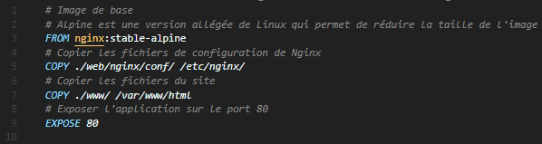

# IntroDocker

IntroDocker est un projet de formation à Docker.

Tandis que le parcours principal d'apprentissage est explicité ici, les fichiers nécessaires à la création d'un container ou d'une composition sont commentés de manière à comprendre chaque étape.

> Aperçu


## Sommaire
- [IntroDocker](#introdocker)
	- [Sommaire](#sommaire)
	- [Installation de Docker](#installation-de-docker)
		- [WSL (Windows)](#wsl-windows)
		- [Docker CLI](#docker-cli)
	- [Utilisation de Docker](#utilisation-de-docker)
		- [Créer une image](#créer-une-image)
			- [Dockerfile](#dockerfile)
			- [Démarrer un conteneur](#démarrer-un-conteneur)
			- [Exécution d'une commande dans un conteneur](#exécution-dune-commande-dans-un-conteneur)
			- [Arrêt d'un conteneur](#arrêt-dun-conteneur)
			- [Suppression d'un conteneur](#suppression-dun-conteneur)
		- [Docker Compose](#docker-compose)
			- [Configuration d'une composition](#configuration-dune-composition)
				- [Volumes](#volumes)
					- [Types de volumes](#types-de-volumes)
					- [Consistency](#consistency)
			- [Démarrage d'une composition Docker](#démarrage-dune-composition-docker)
			- [Arrêt d'une composition Docker](#arrêt-dune-composition-docker)
			- [Suppression d'une composition Docker](#suppression-dune-composition-docker)


## Installation de Docker

Pour installer Docker, il existe deux possibilités principales : Docker/Rancher Desktop (ou
Dockstation sur Linux), et l’installation en CLI (Command Line Interface). Les utilisateurs de Windows pourront utiliser WSL pour installer Docker en CLI.

### WSL (Windows)

Pour installer WSL, on ouvre PowerShell en mode administrateur et on y saisit les commandes:

```powershell
# Pour définir la version de WSL à utiliser par défaut (la 2 est plus récente, performante et recommandée)
- wsl --set-default-version 2
# Pour installer la distribution Debian (ou autre)
- wsl --install -d Debian
# Pour s’assurer que la version de votre distribution est bien WSL 2
- wsl --set-version Debian 2 
```

Une fois WSL installé, on peut désormais installer Docker. On utilise l’utilitaire apt depuis WSL, lancé
en mode administrateur. Pour exécuter des commandes avec les droits super utilisateur, on utilise le
préfixe « sudo » (superuser do). Ensuite, c’est une série de commandes qui installeront Docker, son
moteur et ses dépendances.

### Docker CLI

```bash
sudo apt-get remove docker docker-engine docker.io containerd runc
sudo apt-get update
sudo apt-get install docker.io
sudo apt-get install \
  ca-certificates \
  curl \
  gnupg \
  lsb-release
sudo mkdir -m 0755 -p /etc/apt/keyrings
curl -fsSL <https://download.docker.com/linux/debian/gpg> | sudo gpg --dearmor -o
/etc/apt/keyrings/docker.gpg
echo \
 "deb [arch=$(dpkg --print-architecture) signed-by=/etc/apt/keyrings/docker.gpg]
https://download.docker.com/linux/debian \
 $(lsb_release -cs) stable" | sudo tee /etc/apt/sources.list.d/docker.list >
/dev/null
sudo apt-get update
sudo apt-get install docker-ce docker-ce-cli containerd.io docker-buildx-plugin
docker-compose-plugin
sudo service docker start
# Sur certaines distributions de Linux, on remplace « service docker start » par :
systemctl start docker
systemctl enable docker
# Enfin, pour vérifier que docker fonctionne, on exécute l’image de test « hello-world » :
sudo docker run hello-world
```

Si tout a bien fonctionné, le terminal devrait afficher ce qui suit :

```bash
Hello from Docker!
This message shows that your installation appears to be working correctly.

To generate this message, Docker took the following steps:
 1. The Docker client contacted the Docker daemon.
 2. The Docker daemon pulled the "hello-world" image from the Docker Hub.
  (amd64)
 3. The Docker daemon created a new container from that image which runs the
  executable that produces the output you are currently reading.
 4. The Docker daemon streamed that output to the Docker client, which sent it
  to your terminal.

To try something more ambitious, you can run an Ubuntu container with:
 $ docker run -it ubuntu bash

Share images, automate workflows, and more with a free Docker ID:
 https://hub.docker.com/

For more examples and ideas, visit:
 https://docs.docker.com/get-started/
```

⚠️ Note : Pour ne pas avoir à utiliser « sudo » systématiquement, vous pouvez également vous rajouter
au groupe Docker, en le créant s’il n’existe pas déjà.

```bash
sudo groupadd docker
sudo usermod -aG docker $USER
```

## Utilisation de Docker

### Créer une image

#### Dockerfile

Pour créer un conteneur Docker, il faut construire (build) une image à partir d’un fichier : Le
Dockerfile. C’est ce fichier qui déterminera grâce à des mots clés et des commandes ce que devra
contenir et exécuter le conteneur.  
Le mot clé « `FROM` » signifie que votre image se construira à partir d’une autre qui existe déjà,
et qui sera récupérée depuis le Docker Hub (<https://hub.docker.com/>). Par exemple, pour créer un
projet node, vous pouvez mettre « `FROM` node:latest » où « node » est le nom de l’image et « latest »
le tag de la version. Si vous ne précisez pas de tag, la dernière version sera utilisée.  
Le mot clé « `WORKDIR` » est l’équivalent du « cd » ou « current directory » du terminal, mais à
l’intérieur du conteneur. Toutes les autres commandes de Docker seront exécutées depuis celui-ci.
Le mot clé « `COPY` » permet de copier les fichiers d’une source locale à une destination dans le
conteneur. On utilise « . » des deux côtés pour copier les fichiers adjacents au Dockerfile (sauf si
configuré autrement) dans le `WORKDIR` du conteneur (Ex : `COPY` . .).  
Le mot clé « `RUN` » permet d’exécuter des commandes pour la construction et le démarrage du
conteneur, et celles-ci seront exécutées depuis le `WORKDIR`. Si l’image est en cache, ces commandes
pourraient ne pas s’exécuter.  
Le mot clé « `CMD` » permet également d’exécuter une commande, mais ne fait pas partie des
étapes de construction du conteneur. S’il y a plusieurs `CMD` dans un Dockerfile, seule la dernière sera
exécutée. Il est recommandé d’utiliser RUN pour la construction & l’installation et `CMD` pour le
démarrage.  
Un exemple de Dockerfile:

```dockerfile
# Récupère la dernière version de l’image node depuis le Docker Hub
FROM node:latest
# Définit le WORKDIR du conteneur (équivalent du cd - current directory, à l'intérieur du conteneur)
WORKDIR /usr/src/app
# Copie les fichiers du répertoire courant de l'hôte (le dossier contenant le Dockerfile) vers le WORKDIR du conteneur
COPY . .
# Exécute la commande npm install dans le WORKDIR du conteneur pour installer les dépendances de l'application node (à partir du package.json copié précédemment)
RUN npm install
# Expose le port 3000 du conteneur
EXPOSE 3000
# Exécute la commande npm run start dans le WORKDIR du conteneur pour démarrer le script start de l'application node (script provenant du package.json copié précédemment)
CMD [ "npm", "run", "start" ]
```

#### Démarrer un conteneur

Pour démarrer un conteneur, il faut d’abord construire l’image à partir du Dockerfile. Pour cela, on utilise la commande « `docker build` » en précisant le chemin vers le Dockerfile (par défaut, le chemin est le répertoire courant). On peut également préciser un nom et un tag pour l’image avec « `--tag` ».

```bash
# Construit l'image à partir du Dockerfile dans le répertoire courant et lui donne le nom "mydocker" et le tag "latest"
docker build --tag mydocker:latest .
```

Une fois l’image construite, on peut démarrer un conteneur à partir de celle-ci avec la commande « `docker run` ». On peut préciser le nom du conteneur avec « `--name` » et mapper un port de l’hôte vers un port du conteneur avec « `-p` ».

```bash
# Démarre un conteneur à partir de l'image "mydocker" et lui donne le nom "mydocker-container" en mappant le port 3000 de l'hôte vers le port 3000 du conteneur
docker run --name mydocker-container -p 3000:3000 mydocker
```

#### Exécution d'une commande dans un conteneur

Pour exécuter une commande dans un conteneur, il suffit de trouver le nom du conteneur en exécution avec `docker ps` et d'exécuter la commande suivante:

```bash
# Exécute la commande "sh" dans le conteneur "mydocker-nginx" pour avoir accès au shell du conteneur
docker exec -it mydocker-nginx sh
```

#### Arrêt d'un conteneur

Pour arrêter un conteneur, il suffit de trouver le nom du conteneur en exécution avec `docker ps` et d'exécuter la commande suivante:

```bash
# Arrête le conteneur "mydocker-nginx"
docker stop mydocker-nginx
```

#### Suppression d'un conteneur

Pour supprimer un conteneur, il suffit de trouver le nom du conteneur en exécution avec `docker ps` et d'exécuter la commande suivante:

```bash
# Supprime le conteneur "mydocker-nginx"
docker rm mydocker-nginx
```

### Docker Compose

Docker Compose est un outil qui permet de définir et d’exécuter des applications Docker multi-containers. Avec Compose, on utilise un fichier YAML pour configurer les services de l’application. Ensuite, avec une seule commande, on crée et démarre tous les services à partir de cette configuration.  
Le script [start.sh](/.docker/start.sh) démarre une composition en reconstruisant ou non les conteneurs à partir de 0 selon le choix de l'utilisateur (peut s'avérer utile pour le développement).  

#### Configuration d'une composition

En règle générale, on cherche à séparer chaque service (Serveur web, BDD, ...) dans un conteneur distinct pour faciliter leur gestion. Pour articuler ces conteneurs et les relier les uns aux autres pour faire fonctionner une application, on utilise Docker Compose. C’est le fichier docker-compose.yml qui permet cette configuration. Chaque service doit être nommé et configuré dans ce fichier.  
Dans cet exemple, après avoir donné la version de Docker Compose, on définit un premier service serveur web avec nginx. On peut choisir de partir directement d’une image du Docker Hub (comme avec `FROM`) ou d’utiliser un Dockerfile. Ici,
pour la construction de l’image, on utilisera le Dockerfile dans le sous-dossier web/nginx/ :

[Docker Compose](./.docker/docker-compose.yml)

⚠️ Note: Il est recommandé de déléguer un maximum de tâches au Dockerfile, et en particulier les tâches spécifiques à l'application pour rendre le docker-compose.yml réutilisable.

##### Volumes

Les volumes permettent de faire persister les données lorsque le conteneur s'éteint, afin de pouvoir les récupérer lors du prochain démarrage. Les volumes sont d'importance capitale pour les conteneurs en production, car ils permettent de conserver les données et de les partager entre plusieurs conteneurs, en particulier pour les bases de données.

###### Types de volumes

Il existe plusieurs types de volumes, qui définissent la manière dont les données sont stockées:

- `bind`: monte un dossier ou un fichier depuis l’hôte vers le conteneur. C’est le type de volume
le moins performant puisqu'il utilise le système de fichiers de l'hôte mais permet de modifier les fichiers depuis l'hôte, recommandé pour le développement. À noter que si le dossier/fichier hôte d’un volume n’existe pas, des erreurs peuvent survenir.
- `volume`: monte un dossier ou un fichier depuis le conteneur vers un volume Docker. C’est le type de volume le plus performant, il permet d'assurer la persistance des fichiers à l'extinction du conteneur, recommandé pour la production.
- `tmpfs`: monte un dossier ou un fichier depuis la mémoire vive de l’hôte vers le conteneur. C’est le type de volume le plus performant, mais les données ne sont pas persistantes, recommandé pour les logs.

###### Consistency

La directive « consistency » permet de définir le mode de synchronisation des données entre l’hôte et le conteneur. Il existe trois modes :

- `consistent`: synchronisation instantanée entre l’hôte et le conteneur, peut poser des problèmes de performances si le conteneur écrit beaucoup de données.
- `cached`: les fichiers de l'hôte sont en mode lecture seule pour le conteneur et  les changements sont appliqués avec un délai. Ce mode est recommandé pour le code. Il est plus performant que « consistent » et permet d’éviter les problèmes de performances si le conteneur écrit beaucoup de données.
- `delegated`: les fichiers du conteneur sont en lecture seule pour l'hôte et le conteneur écrit dans l’hôte avec un délai. Ce mode est recommandé pour les logs.

#### Démarrage d'une composition Docker

Pour démarrer une composition Docker, il suffit de se placer dans le dossier contenant le fichier docker-compose.yml avec `cd` et d'exécuter la commande suivante:

```bash
# Voir les différentes options avec docker compose --help
docker compose up
```

#### Arrêt d'une composition Docker

Pour arrêter une composition Docker, il suffit de se placer dans le dossier contenant le fichier docker-compose.yml avec `cd` et d'exécuter la commande suivante:

```bash
# Voir les différentes compositions avec docker compose ps
docker compose down
```

#### Suppression d'une composition Docker

Pour supprimer une composition Docker, il suffit de se placer dans le dossier contenant le fichier docker-compose.yml avec `cd` et d'exécuter la commande suivante:

```bash
# Voir les différentes compositions
docker compose ps
# Supprimer une composition, ses conteneurs, ses réseaux, ses volumes et ses images associées
docker compose rm <composition>

```
